# 智慧校园生活助手 - UML类图 V1.3（实体类）

## 使用方法

### 方法一：在线预览
1. 复制下方 `mermaid` 代码块
2. 访问 [Mermaid Live Editor](https://mermaid.live)
3. 粘贴代码即可实时预览和导出PNG/SVG

### 方法二：生成图片
```bash
npm install -g @mermaid-js/mermaid-cli
mmdc -i classdiagram.mmd -o classdiagram.png -b transparent -w 2400
```

---

## UML 类图（仅实体类）

```mermaid
classDiagram
    direction TB

    %% ==================== 用户实体 ====================
    class User {
        +string userId
        +string phone
        +string nickname
        +string avatar
        +string gender
        +string grade
        +string birthDate
        +string department
        +int height
        +decimal weight
        +string role
        +string status
        +string createTime
        +string lastLoginTime
    }

    %% ==================== 课表实体 ====================
    class Semester {
        +int id
        +string name
        +string startDate
        +string endDate
    }

    class Course {
        +string id
        +string userId
        +int semesterId
        +string title
        +string weekPattern
        +int dayOfWeek
        +int startPeriod
        +int endPeriod
        +string location
    }

    %% ==================== 日程实体 ====================
    class ScheduleEvent {
        +string id
        +string userId
        +string title
        +string category
        +string weekPattern
        +int dayOfWeek
        +int startPeriod
        +int endPeriod
        +string startTime
        +string endTime
        +string deadline
        +string location
        +string remark
        +string reminder
        +string status
        +string countdown
    }

    class Announcement {
        +int id
        +string content
        +string type
        +boolean dismissible
        +string status
        +string createTime
    }

    %% ==================== 健康数据实体 ====================
    class SleepRecord {
        +string id
        +string userId
        +string sleepDate
        +string bedTime
        +string wakeTime
        +decimal duration
        +string quality
        +boolean isAbnormal
        +string createTime
    }

    class ExerciseRecord {
        +string id
        +string userId
        +string type
        +int duration
        +int count
        +string recordDate
        +string createTime
    }

    class WeightRecord {
        +string id
        +string userId
        +decimal weight
        +string recordDate
        +string createTime
    }

    %% ==================== 分析结果实体 ====================
    class SleepAnalysis {
        +List~Alert~ alerts
        +SleepSummary summary
    }

    class Alert {
        +string type
        +string suggestion
    }

    class SleepSummary {
        +decimal avgDuration
        +string avgQuality
    }

    class ExerciseAnalysis {
        +int defaultTarget
        +int adjustedTarget
        +string adjustReason
        +int actualMinutes
        +decimal progress
        +string status
        +List~string~ suggestions
    }

    class PressureAnalysis {
        +int apiScore
        +string level
        +string levelText
        +PressureBreakdown breakdown
    }

    class PressureBreakdown {
        +int courseHours
        +decimal courseContribution
        +int examCount
        +decimal examContribution
        +int ddlCount
        +decimal ddlContribution
        +decimal completionRate
        +decimal completionContribution
    }

    class ProcrastinationAnalysis {
        +int weekCompletionRate
        +int onTimeRate
        +int threshold
        +string alert
        +string suggestion
    }

    class SportSuggestion {
        +boolean hasSuggestion
        +List~SportSlot~ suggestions
    }

    class SportSlot {
        +string startTime
        +string endTime
        +int duration
        +string message
    }

    %% ==================== 周报实体 ====================
    class WeeklyReport {
        +int id
        +string userId
        +int weekNumber
        +string startDate
        +string endDate
        +boolean canRegenerate
        +string regenerateAvailableUntil
        +ReportSections sections
        +List~string~ suggestions
        +string createTime
    }

    class ReportSections {
        +ScheduleSection schedule
        +SleepSection sleep
        +ExerciseSection exercise
        +WeightSection weight
        +PressureSection pressure
    }

    class ScheduleSection {
        +int totalEvents
        +int completed
        +int overdue
    }

    class SleepSection {
        +decimal avgDuration
        +string avgQuality
    }

    class ExerciseSection {
        +int totalMinutes
        +boolean targetMet
    }

    class WeightSection {
        +decimal startWeight
        +decimal endWeight
    }

    class PressureSection {
        +int avgScore
        +string trend
    }

    %% ==================== 日志实体 ====================
    class OperationLog {
        +int id
        +string adminId
        +string adminNickname
        +string action
        +string actionText
        +string targetType
        +string targetId
        +string targetNickname
        +string reasonCode
        +string reasonText
        +Object details
        +string ipAddress
        +string createTime
    }

    class ExceptionLog {
        +int id
        +string userId
        +string exceptionType
        +string exceptionDetail
        +string requestUrl
        +string ipAddress
        +string createTime
    }

    %% ==================== 配置实体 ====================
    class SystemConfig {
        +int id
        +string category
        +string configData
    }

    class ApiWeights {
        +int courseHours
        +int examCount
        +int ddlCount
        +int completionRate
    }

    %% ==================== 关系定义 ====================
    User "1" --> "*" Course : 拥有
    User "1" --> "*" ScheduleEvent : 拥有
    User "1" --> "*" SleepRecord : 拥有
    User "1" --> "*" ExerciseRecord : 拥有
    User "1" --> "*" WeightRecord : 拥有
    User "1" --> "*" WeeklyReport : 拥有
    Semester "1" --> "*" Course : 包含

    Course "1" --> "1" ScheduleEvent : 关联日程
    ScheduleEvent "1" --> "1" Announcement : 触发

    SleepAnalysis "1" --> "*" Alert : 包含
    SleepAnalysis "1" --> "1" SleepSummary : 包含
    PressureAnalysis "1" --> "1" PressureBreakdown : 包含
    WeeklyReport "1" --> "1" ReportSections : 包含
    ReportSections --> "1" ScheduleSection
    ReportSections --> "1" SleepSection
    ReportSections --> "1" ExerciseSection
    ReportSections --> "1" WeightSection
    ReportSections --> "1" PressureSection
    SportSuggestion "1" --> "*" SportSlot : 包含

    SystemConfig "1" --> "*" ApiWeights : 包含
```



---

## 实体类说明

### 用户模块

| 类名 | 说明 |
|------|------|
| User | 用户信息，包含角色、状态、冻结信息等 |

### 课表模块

| 类名 | 说明 |
|------|------|
| Semester | 学期信息 |
| Course | 课程信息 |

### 日程模块

| 类名 | 说明 |
|------|------|
| ScheduleEvent | 日程事件 |
| Announcement | 系统公告 |

### 健康数据模块

| 类名 | 说明 |
|------|------|
| SleepRecord | 睡眠记录 |
| ExerciseRecord | 运动记录 |
| WeightRecord | 体重记录 |

### 分析结果模块

| 类名 | 说明 |
|------|------|
| SleepAnalysis | 睡眠分析 |
| Alert | 健康提醒 |
| SleepSummary | 睡眠摘要 |
| ExerciseAnalysis | 运动分析 |
| PressureAnalysis | 压力分析 |
| PressureBreakdown | 压力分解 |
| ProcrastinationAnalysis | 拖延分析 |
| SportSuggestion | 运动建议 |
| SportSlot | 空闲时段 |

### 周报模块

| 类名 | 说明 |
|------|------|
| WeeklyReport | 周报 |
| ReportSections | 周报各模块 |
| ScheduleSection | 日程统计 |
| SleepSection | 睡眠统计 |
| ExerciseSection | 运动统计 |
| WeightSection | 体重统计 |
| PressureSection | 压力统计 |

### 日志模块

| 类名 | 说明 |
|------|------|
| OperationLog | 操作日志 |
| ExceptionLog | 异常日志 |

### 配置模块

| 类名 | 说明 |
|------|------|
| SystemConfig | 系统配置 |
| ApiWeights | API权重配置 |

---

## 枚举定义

### 角色枚举
```
Role: user | admin | super_admin
```

### 状态枚举
```
UserStatus: normal | frozen
```

### 日程分类
```
Category: course | exam | activity | ddl | personal
```

### 日程状态
```
EventStatus: pending | in_progress | overdue | completed
```

---

*文档版本：V1.3*
*最后更新：2026-06-01*
