# 智慧校园生活助手 - ER图 V1.1

## 使用方法

### 方法一：在线预览
1. 复制下方 `mermaid` 代码块
2. 访问 [Mermaid Live Editor](https://mermaid.live)
3. 粘贴代码即可实时预览和导出PNG/SVG

### 方法二：VS Code / Cursor 预览
1. 安装 Mermaid 插件（如 "Mermaid Markdown Preview"）
2. 在 `.md` 文件中插入代码块即可预览

### 方法三：生成图片
```bash
# 使用 mermaid-cli
npm install -g @mermaid-js/mermaid-cli
mmdc -i erdiagram.mmd -o erdiagram.png -b transparent -w 2400
```

---

## 更新说明 (V1.1)

1. **USER 表**：`role` 扩展为 user/admin/super_admin，新增 `frozen_time`（冻结时间）、`frozen_reason`（冻结原因枚举）
2. **SLEEP_RECORD 表**：新增 `is_abnormal`（是否异常记录）字段
3. **SYSTEM_CONFIG 表**：从 KV 键值对改为 JSON 分组存储，按 category 分类（health/api/system）
4. **ADMIN_LOG 表**：新增 `action_text`、`reason_code`、`reason_text`、`ip_address` 等字段

---

## ER 图

```mermaid
erDiagram
    %% ==================== 用户模块 ====================
    USER {
        string user_id PK "用户ID (usr_xxx)"
        string phone UK "手机号"
        string password "密码(加密)"
        string nickname "昵称"
        string avatar "头像URL"
        string gender "性别: 未知/男/女"
        string grade "年级: 大一/大二/大三/大四/研究生"
        date birth_date "出生日期"
        string department "院系/专业"
        int height "身高(cm)"
        decimal weight "体重(kg)"
        string role "角色: user/admin/super_admin"
        string status "状态: normal/frozen"
        timestamp frozen_time "冻结时间"
        string frozen_reason "冻结原因枚举"
        timestamp create_time "创建时间"
        timestamp last_login_time "最后登录时间"
    }

    VERIFY_CODE {
        string phone PK,FK "手机号"
        string code "验证码"
        string type "类型: register/bind"
        timestamp expire_time "过期时间"
    }

    %% ==================== 课表与日程模块 ====================
    SEMESTER {
        int semester_id PK "学期ID"
        string name "学期名称"
        date start_date "开始日期"
        date end_date "结束日期"
        boolean is_current "是否为当前学期"
    }

    USER_SEMESTER {
        string user_id PK,FK "用户ID"
        int semester_id PK,FK "学期ID"
    }

    COURSE {
        int course_id PK "课程ID"
        string user_id FK "用户ID"
        int semester_id FK "学期ID"
        string name "课程名称"
        string week_pattern "周次模式"
        int day_of_week "星期(1-7)"
        int start_period "开始节次"
        int end_period "结束节次"
        string location "上课地点"
    }

    SCHEDULE_EVENT {
        string event_id PK "事件ID (evt_xxx)"
        string user_id FK "用户ID"
        string title "标题"
        string category "分类: course/exam/activity/ddl/personal"
        datetime start_time "开始时间"
        datetime end_time "结束时间"
        datetime deadline "截止时间"
        string location "地点"
        string remark "备注"
        string reminder "提醒设置"
        string status "状态: pending/in_progress/overdue/completed"
        timestamp create_time "创建时间"
    }

    ANNOUNCEMENT {
        int id PK "公告ID"
        string content "公告内容"
        string type "类型: system/sport"
        boolean dismissible "是否可关闭"
        string status "状态: active/offline"
        timestamp create_time "创建时间"
    }

    USER_ANNOUNCEMENT {
        string user_id PK,FK "用户ID"
        int announcement_id PK,FK "公告ID"
        boolean dismissed "是否已关闭"
    }

    %% ==================== 健康数据模块 ====================
    SLEEP_RECORD {
        string record_id PK "记录ID"
        string user_id FK "用户ID"
        date sleep_date "睡眠归属日期"
        datetime bed_time "入睡时间"
        datetime wake_time "起床时间"
        decimal duration "睡眠时长"
        string quality "质量"
        boolean is_abnormal "是否异常记录"
        timestamp create_time "创建时间"
    }

    EXERCISE_RECORD {
        string record_id PK "记录ID"
        string user_id FK "用户ID"
        string type "运动类型"
        int duration "时长(分钟)"
        int count "频次"
        date record_date "记录日期"
        timestamp create_time "创建时间"
    }

    WEIGHT_RECORD {
        string record_id PK "记录ID"
        string user_id FK "用户ID"
        decimal weight "体重(kg)"
        date record_date "记录日期"
        timestamp create_time "创建时间"
    }

    %% ==================== 分析与周报模块 ====================
    WEEKLY_REPORT {
        int report_id PK "周报ID"
        string user_id FK "用户ID"
        int week_number "周数"
        date start_date "开始日期"
        date end_date "结束日期"
        json sections "统计数据"
        string suggestions "建议"
        timestamp create_time "生成时间"
    }

    %% ==================== 系统配置模块 ====================
    SYSTEM_CONFIG {
        int id PK "配置ID"
        string category "配置分类: health/api/system"
        json config_data "配置JSON"
        timestamp update_time "更新时间"
    }

    %% ==================== 管理员模块 ====================
    ADMIN_LOG {
        int log_id PK "日志ID"
        string admin_id FK "管理员ID"
        string action "操作类型枚举"
        string action_text "操作描述"
        string target_type "目标类型: user/announcement/config"
        string target_id "目标ID"
        string reason_code "原因代码枚举"
        string reason_text "原因描述"
        json details "详情JSON"
        string ip_address "操作IP"
        timestamp create_time "操作时间"
    }

    %% ==================== 关系定义 ====================
    USER ||--o{ VERIFY_CODE : "发送验证码"
    USER ||--o{ USER_SEMESTER : "选择学期"
    SEMESTER ||--o{ USER_SEMESTER : "被选择"

    USER ||--o{ COURSE : "导入课程"
    SEMESTER ||--o{ COURSE : "包含课程"

    USER ||--o{ SCHEDULE_EVENT : "创建日程"
    SCHEDULE_EVENT }o--|| COURSE : "可关联课程"

    USER ||--o{ SLEEP_RECORD : "记录睡眠"
    USER ||--o{ EXERCISE_RECORD : "记录运动"
    USER ||--o{ WEIGHT_RECORD : "记录体重"

    USER ||--o{ WEEKLY_REPORT : "生成周报"
    USER ||--o{ USER_ANNOUNCEMENT : "查看公告"
    ANNOUNCEMENT ||--o{ USER_ANNOUNCEMENT : "被查看"

    USER ||--o| ADMIN_LOG : "被管理操作"
    ADMIN_LOG }o--|| USER : "操作者"
```



---

## 实体说明

### 用户模块

| 表名 | 说明 |
|------|------|
| USER | 用户主表，存储用户基本信息和账号状态 |
| VERIFY_CODE | 验证码表，用于注册和换绑场景 |

### 课表与日程模块

| 表名 | 说明 |
|------|------|
| SEMESTER | 学期表，存储学期信息 |
| USER_SEMESTER | 用户-学期关联表，记录用户选择的当前学期 |
| COURSE | 课程表，存储用户导入的课程信息 |
| SCHEDULE_EVENT | 日程事件表，存储用户创建的各类日程 |
| ANNOUNCEMENT | 公告表，存储系统公告 |
| USER_ANNOUNCEMENT | 用户-公告关联表，记录用户是否关闭过公告 |

### 健康数据模块

| 表名 | 说明 |
|------|------|
| SLEEP_RECORD | 睡眠记录表 |
| EXERCISE_RECORD | 运动记录表 |
| WEIGHT_RECORD | 体重记录表 |

### 分析与周报模块

| 表名 | 说明 |
|------|------|
| WEEKLY_REPORT | 周报表，存储自动生成的周报数据 |

### 系统配置模块

| 表名 | 说明 |
|------|------|
| SYSTEM_CONFIG | 系统配置表，按 category 分组存储 JSON 配置 |

### 管理员模块

| 表名 | 说明 |
|------|------|
| ADMIN_LOG | 管理日志表，记录管理员的所有操作 |

---

## 枚举定义

### 用户角色枚举

| 值 | 说明 |
|----|------|
| user | 普通用户 |
| admin | 普通管理员 |
| super_admin | 超级管理员 |

### 日程分类枚举

| 值 | 说明 |
|----|------|
| course | 课程 |
| exam | 考试 |
| activity | 活动 |
| ddl | 作业/DDL |
| personal | 个人事项 |

### 日程状态枚举

| 值 | 说明 |
|----|------|
| pending | 待办中 |
| in_progress | 进行中 |
| overdue | 已逾期（仅DDL） |
| completed | 已完成 |

### 冻结原因枚举

| 值 | 说明 |
|----|------|
| content_violation | 内容违规 |
| security_risk | 安全风险 |
| abnormal_checkin | 异常打卡 |
| other | 其他原因 |

### 管理员操作枚举

| action | 说明 |
|--------|------|
| freeze_user | 冻结用户 |
| unfreeze_user | 解封用户 |
| publish_announcement | 发布公告 |
| offline_announcement | 下架公告 |
| update_config | 更新配置 |
| create_admin | 创建管理员 |

---

*文档版本：V1.1*
*最后更新：2026-05-26*
