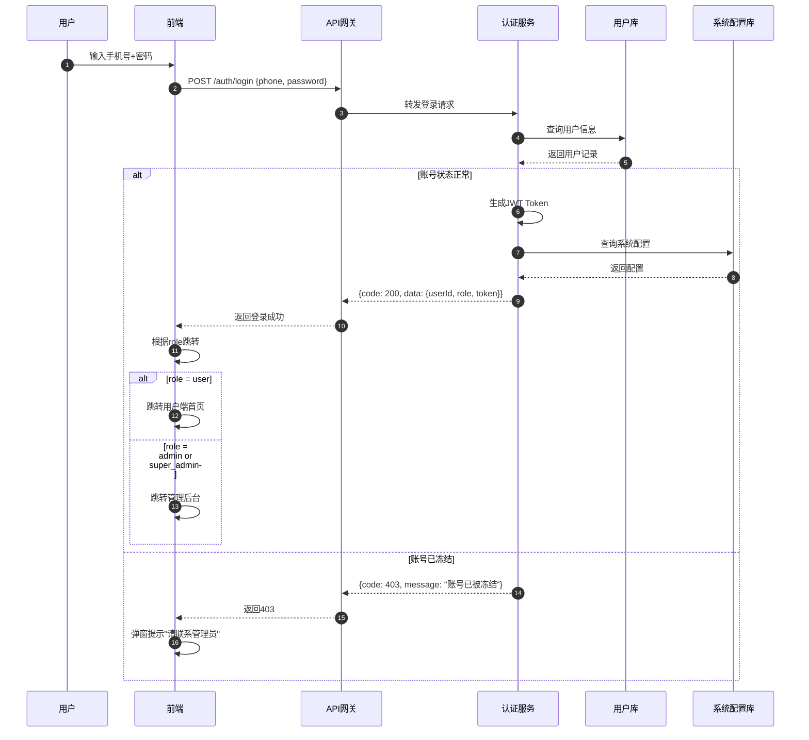
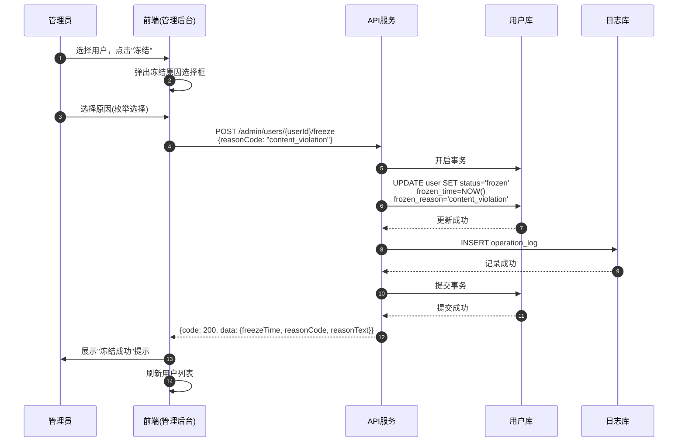
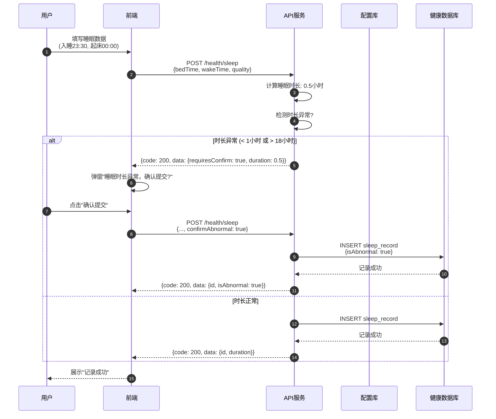
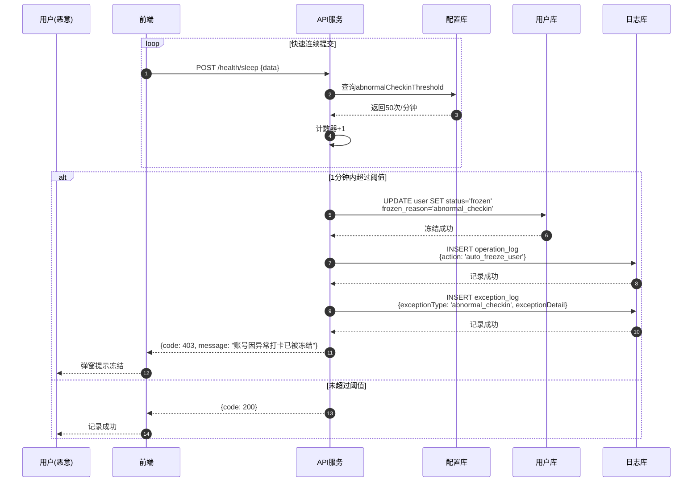
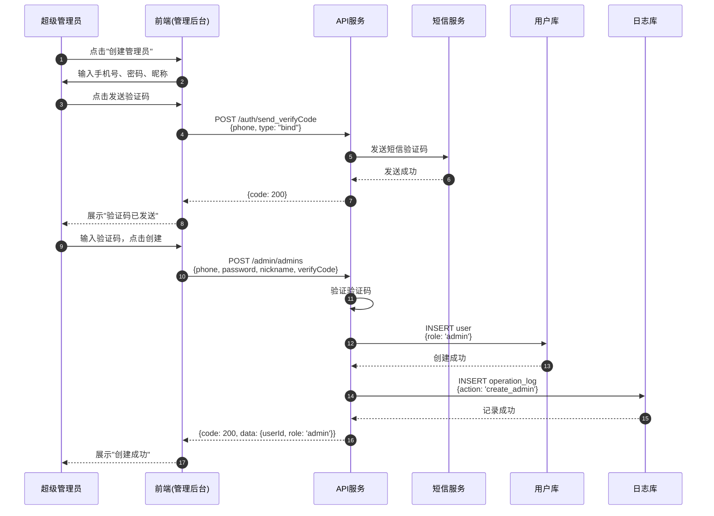
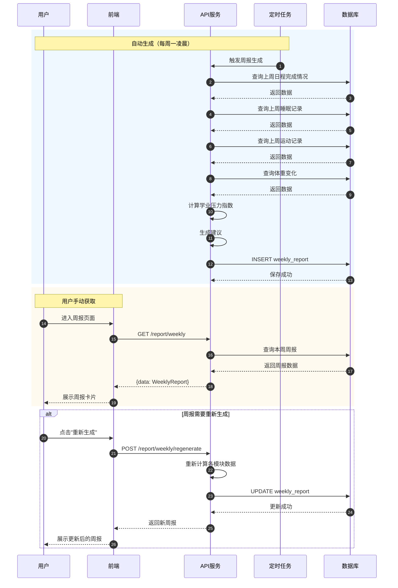

# 智慧校园生活助手 - 序列图

## 使用方法

### 方法一：在线预览
1. 访问 [Mermaid Live Editor](https://mermaid.live)
2. 复制粘贴下方代码块
3. 点击 PNG/SVG 下载

### 方法二：命令行生成
```bash
npm install -g @mermaid-js/mermaid-cli
mmdc -i sequence-diagram.mmd -o sequence-diagram.png -b transparent -w 2400
```

---

## 序列图 1：统一登录流程



---

## 序列图 2：管理员冻结用户



---

## 序列图 3：睡眠记录（含异常确认）



---

## 序列图 4：异常打卡自动冻结



---

## 序列图 5：创建管理员（仅超级管理员）



---

## 序列图 6：周报生成



---

*文档版本：V1.2*
*最后更新：2026-05-31*
